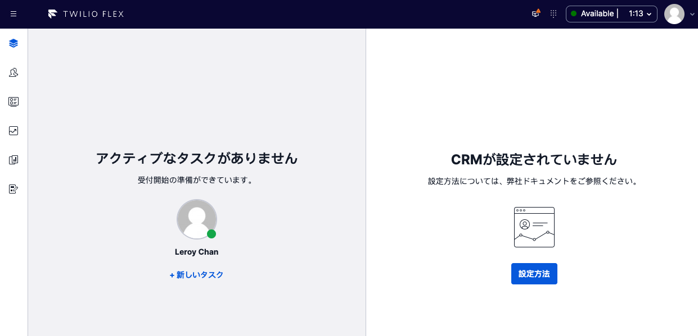
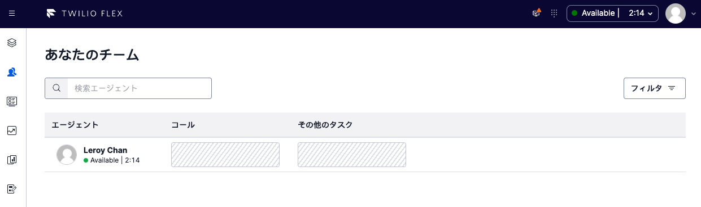
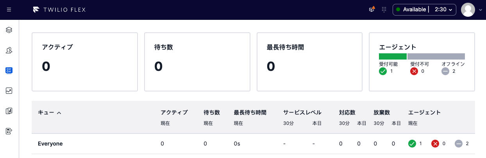

# Twilio Flex 2.0 - Localization - Japanese

Simple one-liner plugin that enables Japanese language localization all agents on Flex UI 2.x.

For localization of multiple languages (w/ language switcher), please refer to [Twilio PS - Flex Localization Plugin](https://github.com/twilio-professional-services/plugin-flex-localization)

Credits to Jun Aita for the Japanese translation file







---

## Pre-requisites

1. Twilio Flex Account ([Guide](https://support.twilio.com/hc/en-us/articles/360020442333-Setup-a-Twilio-Flex-Account))
2. Node.js v14.x.x or v16.x.x ([Guide](https://docs.npmjs.com/downloading-and-installing-node-js-and-npm))
3. Twilio CLI v5.2.2 or above ([Guide](https://www.twilio.com/docs/twilio-cli/quickstart))
4. Twilio CLI Flex Plugin v6.0.3 or above ([Guide](https://www.twilio.com/docs/flex/developer/plugins/cli))

---

## Getting Started

On your terminal, perform the following:

```
// Clone Project
git clone https://github.com/leroychan/twilio-flex-localization-japanese.git

// Change to working directory
cd twilio-flex-localization-japanese

// Install NPM Packages
npm install

// Local Development
twilio flex:plugins:start

// Deploy to Twilio Flex Instance
// Before you deploy, ensure that `twilio profiles:list` has an active account set.
twilio flex:plugins:deploy --changelog "Deploy Localization of Japanese Language"
twilio flex:plugins:release --plugin twilio-flex-localization-japanese@0.0.1 --name "Flex UI 2.x - Localization - Japanese" --description "Localization for Flex UI 2.x - Japanese"
```

---

## Credit(s)

Jun Aita for the Japanese Translation

## License

MIT
